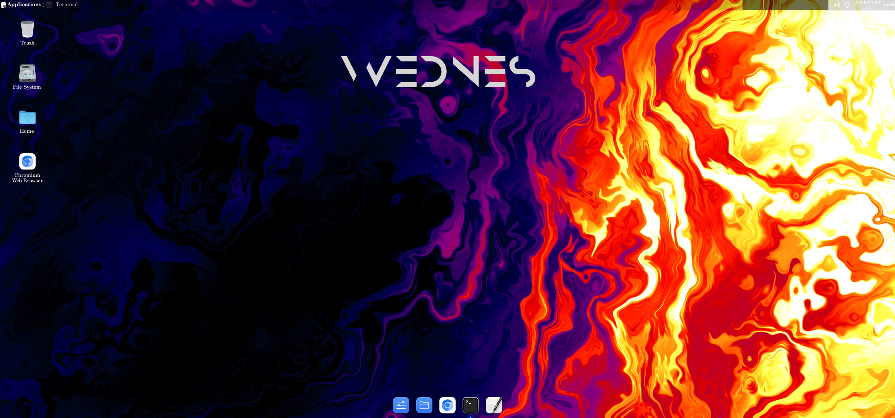

# Modded-Debian

A modded Debian environment for Termux, running through `proot-distro`, with both a full **GUI desktop** (via Termux:X11) and a lightweight **terminal-only** mode.

Made by **Firos Sha Muhammad** ([@FsBotzTg](https://github.com/FsBotzTg))

---

## Preview



---

## Features

- Prebuilt, ready-to-use Debian rootfs for Termux
- Full desktop GUI via Termux:X11
- Fast terminal-only mode when you don't need the desktop
- Single-script installer — no manual `proot-distro` setup required

## Requirements

- [Termux](https://github.com/termux/termux-app/releases) (GitHub or F-Droid build — the Play Store version is outdated and unsupported)
- [Termux:X11](https://github.com/termux/termux-x11/releases) APK, installed **before** running the installer
- Enough free storage for the Debian rootfs and GUI packages

## Installation

Clone this repo and run the installer:

```bash
git clone https://github.com/FsBotzTg/Modded-Debian
cd Modded-Debian
bash install.sh
```

Or run it directly with one command:

```bash
curl -O https://raw.githubusercontent.com/FsBotzTg/Modded-Debian/main/install.sh && bash install.sh
```


The script will install the required Termux packages, download the Debian rootfs, and set up two launcher commands.

## Usage

| Command   | What it does                                              |
|-----------|-------------------------------------------------------------|
| `debian`  | Launches the **GUI** desktop (open the Termux:X11 app first) |
| `debiant` | Launches the **terminal-only** version                      |

## Credits

Modded-Debian is created and maintained by **Firos Sha Muhammad**.

## License

[MIT](./LICENSE)
